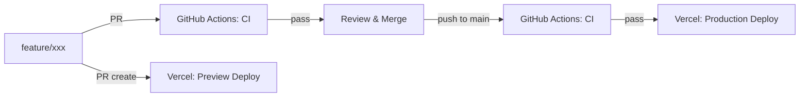

# 6.1 部署说明文档（Runbook）

**项目：** KONG JUN SIENG — Software Developer Portfolio  
**文档目标：** 定义 Vercel 部署流程、CI 流水线与分支策略，AI 按此配置部署环境和 CI 流水线。

---

## 一、项目概述

| 项目 | 值 |
|------|-----|
| 技术栈 | Next.js 16 + TypeScript Strict + Tailwind CSS v4 |
| 包管理 | pnpm ≥9.0.0 |
| 源码托管 | GitHub (KONGJUNSIENG/Junsieng2Dportfolio) |
| CI | GitHub Actions (lint + typecheck + build) |
| 部署平台 | Vercel (Hobby 计划) |
| 生产域名 | `junsieng-portfolio.vercel.app` |
| 预览域名 | `junsieng-portfolio-git-{branch}.vercel.app`（自动生成） |

---

## 二、前提条件

### 2.1 所需账户

| 平台 | 用途 | 是否需要付费 |
|------|------|-------------|
| GitHub | 源码托管 + CI | 免费 |
| Vercel | 部署托管 | Hobby 计划免费（足够） |

### 2.2 本地开发环境要求

| 工具 | 版本要求 | 验证命令 |
|------|---------|---------|
| Node.js | ≥22.0.0 | `node -v` |
| pnpm | ≥9.0.0 | `pnpm -v` |
| Git | ≥2.40 | `git --version` |

### 2.3 权限矩阵

| 操作 | 所需权限 |
|------|---------|
| 推送代码至 main | GitHub 仓库写权限 |
| 创建/合入 PR | GitHub 仓库写权限 |
| 触发 CI 流水线 | 自动（push/PR 触发） |
| 部署至 Production | Vercel 项目管理员（GitHub 集成自动授权） |
| 回滚生产版本 | Vercel 项目管理员 |

---

## 三、分支策略与工作流

### 3.1 分支结构

```
main                    ← 生产分支，保护分支，禁止直接推送
├── feature/*            ← 新功能开发
├── fix/*                ← 修复
└── chore/*              ← 配置/依赖/文档
```

### 3.2 标准工作流



详细步骤：

| # | 操作 | 产出 |
|---|------|------|
| 1 | 从 `main` 创建分支 `feature/{描述}` | 新分支 |
| 2 | 本地开发、测试 | 代码变更 |
| 3 | 推送分支至 GitHub | 远程分支 |
| 4 | 创建 PR → `main` | GitHub PR |
| 5 | 自动触发 CI（lint + typecheck + build） | CI 状态 |
| 6 | 自动触发 Vercel Preview 部署 | Preview URL |
| 7 | 预览确认无误 → 合入 PR | 代码合并至 main |
| 8 | 自动触发 CI | CI 状态 |
| 9 | 自动触发 Vercel Production 部署 | 生产环境更新 |

### 3.3 分支保护规则（GitHub 设置）

| 规则 | 值 |
|------|-----|
| 要求 PR 审查 | 否（单人项目） |
| 要求 CI 通过 | 是（lint + typecheck + build 必须通过） |
| 禁止直接推送至 main | 是（通过分支规则保护） |
| 要求分支最新 | 推荐 |

---

## 四、CI/CD 流水线

### 4.1 GitHub Actions 工作流

CI YAML 完整内容见 [[完整技术规格书与开发计划.md#七]]。核心流程：

- `pnpm install --frozen-lockfile`
- `pnpm run lint`
- `pnpm run typecheck`
- `pnpm run build`

**关键说明：**

| 配置 | 理由 |
|------|------|
| `--frozen-lockfile` | 确保 lockfile 与 package.json 一致，防止依赖漂移 |
| `node-version: 22` | 与本地开发环境一致 |
| `cache: pnpm` | 缓存 node_modules 加速安装 |

### 4.2 npm scripts 清单

确保 `package.json` 包含以下脚本：

```jsonc
{
  "scripts": {
    "dev": "next dev",
    "build": "next build",
    "start": "next start",
    "lint": "eslint",
    "typecheck": "tsc --noEmit"
  }
}
```

### 4.3 CI 失败处理流程

```
CI 失败
├── lint 失败
│   └── 运行 `pnpm run lint --fix` → 检查 ESLint 规则
├── typecheck 失败
│   └── 运行 `pnpm run typecheck` 本地 → 修复类型错误
├── build 失败
│   └── 运行 `pnpm run build` 本地 → 修复构建错误
│
└── 修复后重新推送 → 自动重新触发 CI
```

---

## 五、Vercel 部署配置

### 5.1 Vercel 项目创建步骤

Vercel 面板配置项速查表见 [[6.2 部署环境配置表.md#三]]。

| # | 操作 | 说明 |
|---|------|------|
| 1 | 登录 [vercel.com](https://vercel.com)（GitHub 账号登录） | — |
| 2 | Dashboard → "Add New Project" | — |
| 3 | Import Git Repository → 选择 `KONGJUNSIENG/Junsieng2Dportfolio` | 确保 GitHub 已授权 Vercel |
| 4 | **Framework Preset** → Next.js（自动检测） | — |
| 5 | **Root Directory** → `./`（默认） | — |
| 6 | **Build Command** → `next build`（自动检测） | — |
| 7 | **Output Directory** → `.next`（自动检测） | — |
| 8 | **Node.js Version** → 22.x | 与本地开发一致 |
| 9 | **Environment Variables** → 无（当前项目无环境变量需求） | — |
| 10 | **Project Name** → `junsieng-portfolio` | — |
| 11 | Click "Deploy" | — |

### 5.2 部署环境

| 环境 | 域名 | 触发方式 | 说明 |
|------|------|---------|------|
| **Production** | `junsieng-portfolio.vercel.app` | push to `main` | 最终上线环境 |
| **Preview** | `junsieng-portfolio-git-{branch}-{hash}.vercel.app` | PR 创建/更新 | 每个 PR 独立预览 |
| **Development** | `http://localhost:3000` | `pnpm dev` | 本地热更新开发 |

### 5.3 Vercel 项目配置项

| 配置项 | 值 | 说明 |
|--------|-----|------|
| Framework | Next.js | 自动检测 |
| Root Directory | `./` | 项目根目录 |
| Build Command | `next build` | — |
| Output Directory | `.next` | — |
| Install Command | `pnpm install` | — |
| Node.js Version | 22.x | — |
| Environment Variables | 无（当前 v1） | — |
| Automatic Exposes System Variables | 启用 | `VERCEL_URL`, `VERCEL_ENV` 等 |
| Deployment Protection | 启用（默认） | 见 §5.4 |
| Header Rules | 无（默认） | — |
| Redirect Rules | 无（默认，由 proxy.ts 处理） | — |

### 5.4 部署保护（Preview Deployments）

Vercel Hobby 计划默认对 Preview Deployments 启用部署保护：

| 项目 | 值 |
|------|-----|
| Protection Bypass for Production | 关闭（无需绕过） |
| Password Protection | Vercel 默认生成（可在 Settings → Deployment Protection 查看/修改） |
| 建议 | 保留默认保护，避免未完成的 PR 预览被爬虫索引 |

### 5.5 域名配置

当前使用 Vercel 默认域名 `junsieng-portfolio.vercel.app`。

如需未来添加自定义域名：

| # | 操作 | 说明 |
|---|------|------|
| 1 | 购买域名（如 `kongjunseng.com`）| Namecheap / Cloudflare / GoDaddy |
| 2 | Vercel Dashboard → Project → Settings → Domains | — |
| 3 | 输入域名 → Vercel 自动生成 DNS 配置 | — |
| 4 | 在域名注册商处添加 `CNAME` 记录 → `cname.vercel-dns.com` | — |
| 5 | 等待 DNS 生效（通常 <10 分钟） | — |
| 6 | SSL 证书自动签发（Vercel 自动处理） | — |

---

## 六、GitHub 仓库设置

### 6.1 仓库要求

| 配置 | 值 |
|------|-----|
| 仓库可见性 | Public（推荐 Portfolio）或 Private |
| Default Branch | `main` |
| 保护规则 | 见 §3.3 |

### 6.2 GitHub Secrets

当前 v1 **无需**任何 GitHub Secrets（无环境变量、无 API Key）。

未来如需（如联系表单后端）：

| Secret 名称 | 用途 | 来源 |
|------------|------|------|
| `RESEND_API_KEY` | Resend 邮件 API | Resend Dashboard |

---

## 七、首次部署流程

### 7.1 完整部署步骤

| # | 操作 | 命令/位置 | 预期结果 |
|---|------|----------|---------|
| 1 | 本地验证构建 | `pnpm run build` | Build 成功，无报错 |
| 2 | 本地验证 lint | `pnpm run lint` | 无 error |
| 3 | 本地验证 typecheck | `pnpm run typecheck` | 退出码 0 |
| 4 | 推送至 GitHub 仓库 | `git push origin main` | 代码推送到远程 |
| 5 | 检查 CI 执行 | GitHub → Actions 标签页 | CI 工作流运行成功 |
| 6 | 在 Vercel 创建项目 | 按 §5.1 步骤 | 自动触发首次部署 |
| 7 | 验证 Production 部署 | 访问 `junsieng-portfolio.vercel.app` | 页面正常渲染，i18n 切换正常 |
| 8 | 测试可选 | 创建一个测试 PR 验证 Preview | Preview URL 可访问 |

### 7.2 部署后验证清单

首次部署成功后，逐项验证：

- [ ] Intro 页面正常渲染（`/zh/intro` `/ja/intro` `/en/intro`，`/` 自动重定向至此）
- [ ] 首页所有 Section 正确渲染（Hero / Case Studies / Projects / About / Contact）
- [ ] 三语切换正常（`/zh` `/ja` `/en`）
- [ ] 锚点导航跳转正确（`#case-studies` `#projects` `#about` `#contact`）
- [ ] Case Study 详情页可访问（`/zh/projects/casestudy`）
- [ ] 立绘图片正常加载（Hero 区块）
- [ ] 字体渲染正确（日文/英文/中文各自字体）
- [ ] 响应式布局在各断点正常
- [ ] 动效按预期触发
- [ ] 简历下载按钮正常
- [ ] 404 页面正确显示
- [ ] `sitemap.xml` 可访问（`/sitemap.xml`）
- [ ] `robots.txt` 可访问（`/robots.txt`）
- [ ] Lighthouse 检查：Performance ≥ 90, Accessibility ≥ 95, SEO ≥ 95

---

## 八、回滚流程

### 8.1 Vercel 即时回滚


详细步骤：

| # | 操作 | 路径 | 说明 |
|---|------|------|------|
| 1 | 登录 Vercel Dashboard | `vercel.com/junsieng-portfolio` | — |
| 2 | 进入 Project → Deployments | — | 查看部署历史 |
| 3 | 找到目标回滚版本 | 时间戳 + Commit 信息 | 选择最后一个稳定版本 |
| 4 | 点击该部署项的 `⋯` 菜单 | — | — |
| 5 | 选择 "Promote to Production" | — | 立即生效，无构建过程 |

### 8.2 Git 回滚（配合回滚部署）

| 场景 | 操作 | 命令 |
|------|------|------|
| 需要修复后重新部署 | `git revert HEAD` → 推送 | `git revert HEAD && git push origin main` |
| 需要回到历史版本 | `git reset --hard {hash}` → 推送（谨慎） | `git reset --hard {hash} && git push --force-with-lease origin main` |

**注意：** `git reset --hard` 会丢失历史，单人项目可容忍，多人协作需避免。

### 8.3 回滚决策矩阵

| 故障类型 | 处理方式 | 回滚优先级 |
|----------|---------|-----------|
| 样式错乱/布局异常 | Vercel 即时回滚 | 高 |
| 功能不完整（非阻塞） | 创建修复 PR，正常流程 | 低 |
| 构建失败 | CI 拦截，不会部署到生产 | 无需回滚 |
| 404/500 错误 | Vercel 即时回滚 | 紧急 |
| 内容错误（如文字写错） | 创建修复 PR，正常流程 | 低 |

---

## 九、监控与告警

### 9.1 当前状态（v1）

| 监控项 | 状态 | 说明 |
|--------|------|------|
| Vercel Status Dashboard | 可用 | `www.vercel-status.com` |
| Deployment 日志 | 自动记录 | Vercel Dashboard → Deployments → 每个部署的 Build Log |
| Runtime 日志 | 自动记录 | Vercel Dashboard → Functions → Logs |
| 错误跟踪 | 无 | v1 不接入 Sentry |
| 访问统计 | 无 | v1 不接入 Vercel Analytics / Plausible |
| 可用性监控 | Vercel 内置 | Vercel 平台自动监控 |

### 9.2 未来扩展（P2）

| 监控项 | 接入方式 |
|--------|---------|
| 访问统计 | Vercel Analytics（一行代码接入）或 Plausible |
| 错误跟踪 | Sentry（Next.js 集成） |
| 性能监控 | Vercel Speed Insights（自动） |

---

## 十、故障排除

### 10.1 常见问题与解决方案

| 问题 | 可能原因 | 解决方案 |
|------|---------|---------|
| CI 中 `pnpm install` 失败 | lockfile 与 package.json 不匹配 | 本地删除 `pnpm-lock.yaml`，重新 `pnpm install` |
| CI 中 Build 失败但在本地成功 | 操作系统差异或缓存 | 确认 `--frozen-lockfile` 移除后重试，确认 `tsconfig.json` 路径正确 |
| Vercel 部署后页面空白 | Build 错误 / 路由问题 | 检查 Vercel Build Log；确认 `next.config.ts` 配置正确 |
| Vercel 部署后样式错乱 | Tailwind 版本兼容 / PostCSS 配置 | 确认 `@tailwindcss/postcss` 和 `postcss.config.mjs` 配置正确 |
| 语言切换后 URL 不变 | middleware 未正确拦截 | 确认 `matcher` 配置覆盖所有页面路径 |
| 图片不显示 | 路径不正确 / 静态 import 问题 | 确认 `public/images/` 下文件路径正确 |
| 字体不生效 | `next/font` 配置错误 | 确认字体文件路径和 CSS 变量名正确 |
| Preview 部署 404 | 动态路由未在 Preview 初始化 | Preview 需要首次访问时触发 Serverless Function 冷启动 |
| `pnpm run dev` 正常但 `pnpm run build` 失败 | 翻译键缺失或数据类型不匹配 | 确认 `src/data/` 与 `src/messages/` 下所有文件完整一致 |

### 10.2 冷启动说明

Vercel Serverless Functions 有冷启动（Cold Start）问题：

| 环境 | 冷启动延迟 | 说明 |
|------|-----------|------|
| Production | < 1 秒 | 长期有流量维持热实例 |
| Preview | 1-3 秒 | 首次或低频访问时较慢 |

本项目使用动态渲染（SSR）模式，页面在每次请求时由 Serverless Function 生成。Vercel Hobby 计划的冷启动延迟通常 <1 秒。

### 10.3 Build 性能优化

| 优化项 | 当前值 | 说明 |
|--------|-------|------|
| `output: "standalone"` | 未启用 | 非 Docker 部署不需要 |
| Image Optimization | Next.js 自动 | `next.config.ts` 已配置 `formats: ["avif", "webp"]` |
| 字体 Subset | `next/font` 自动 | 字体文件自动 subset，无需手动操作 |

---

## 十一、安全规范

### 11.1 敏感信息保护

| 项目 | 规范 |
|------|------|
| 环境变量 | 不在代码中硬编码，通过 Vercel Dashboard → Settings → Environment Variables 配置 |
| Secrets | GitHub Secrets 管理 CI 令牌 |
| `.env.local` | 加入 `.gitignore`，永不提交 |
| `.env.example` | 提交到仓库，包含变量名模板（值留空） |

### 11.2 Vercel 安全配置

| 配置项 | 建议值 | 说明 |
|--------|--------|------|
| Deployment Protection | 启用 | 防止 Preview 被未授权访问 |
| Automatic HTTPS | 启用 | Vercel 自动签发和续期 SSL |
| HSTS | 默认启用 | — |
| Password Protection | Vercel 默认 | 可在 Settings 中查看/修改 |

### 11.3 CSP（Content Security Policy）

当前 v1 不设置自定义 CSP，使用 Vercel 默认安全头。

如需自定义，在 `next.config.ts` 中配置：

```typescript
const nextConfig = {
  async headers() {
    return [
      {
        source: "/(.*)",
        headers: [
          {
            key: "Content-Security-Policy",
            value: "default-src 'self'; script-src 'self' 'unsafe-eval'; style-src 'self' 'unsafe-inline'; img-src 'self' data:;",
          },
        ],
      },
    ]
  },
}
```

---

## 十二、日常维护清单

| 频率 | 任务 | 说明 |
|------|------|------|
| 每次提交 | 运行 `pnpm run lint + typecheck + build` | CI 自动验证 |
| 每次内容更新 | 推送后确认 Vercel 部署成功 | 查看 Vercel Dashboard |
| 每月 | 检查依赖更新 | `pnpm outdated` → 手动更新关键依赖 |
| 每季度 | 检查 Vercel 使用配额 | Hobby 计划限制：100GB 带宽/月，100 小时构建时长/月 |
| 按需 | 更新字体文件 | 放入 `public/fonts/` → 推送 → 自动生效 |
| 按需 | 替换简历 PDF | 覆盖 `public/resume-{lang}.pdf` → 推送 → 自动生效 |


